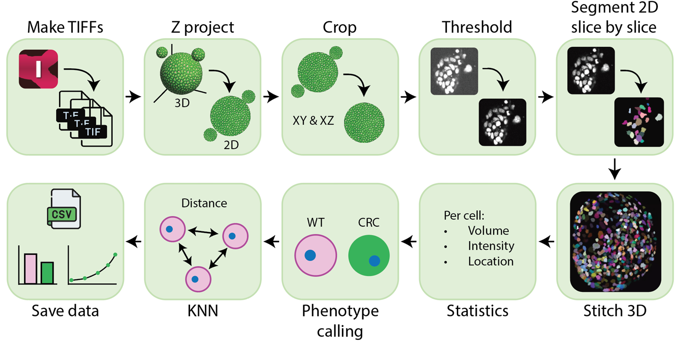

# Organoid Segmenter

A program to segment and phenotype all cells in an organoid or generate cropped versions of your organoid containing IMS files.



[](https://github.com/SebastianVanDijk/organoid_segmenter/main/miscellaneous/example_movie.mp4)

# Installation instructions

1. If conda is not installed: Go to https://www.anaconda.com/download/success and download miniconda for all users

2. Download the repository by downloading the zip file from the green code button above. Or clone the https://github.com/SebastianVanDijk/organoid_segmenter.git repository if you are more familiar with git.

3. If you did **not** clone the repository in step 2: Download the raw models by going into the model folder listed above, go into both the *cell_segmentation* and *sam2.1_hiera_small.pt* files and download the raw files. Place these in the models directory you downloaded in step 2.

4. Start the organoid_segmenter.bat by double clicking, the first time you do this it will take some time.
   (You will also double click this file to start the app the next time you want to use it).

5. If this isnt working, possibly change the .bat file to point it to the correct anaconda installation location. (So change the following line to match your install location):
```
    call "C:\ProgramData\miniconda3\Scripts\activate.bat" "C:\ProgramData\miniconda3"
```

# Using Organoid Segmenter

Please make sure the input files (tiff or ims) are all placed in unique folders. For example if you want to analyse two organoids, the folder structure should be: *experiment_1/organoid_1/organoid_1.ims* and *experiment_1/organoid_2/organoid_2.ims*  

In the program, you can select the directory that contains the samples you want to analyse. Following the example, this corresponds to the *experiment_1* folder.  

Both tiff and ims files can be used as input. However, ims files are prefered as they often contain more metadata that can be usefull during analysis (such as voxel size and time resolution).

# References
Based on initial pipeline by Mario Ledesma Terrón, adapted and extended by Sebastian van Dijk.

Also makes use of Cellpose 4 and Meta SAM:
1. Cellpose-SAM: superhuman generalization for cellular segmentation;
Marius Pachitariu, Michael Rariden, Carsen Stringer;
bioRxiv 2025.04.28.651001; doi: https://doi.org/10.1101/2025.04.28.651001
2. SAM 2: Segment Anything in Images and Videos;
 Ravi, Nikhila and Gabeur, Valentin and Hu, Yuan-Ting and Hu, Ronghang and Ryali, Chaitanya and Ma, Tengyu and Khedr, Haitham and Radle, Roman and Rolland, Chloe and Gustafson, Laura and Mintun, Eric and Pan, Junting and Alwala, Kalyan Vasudev and Carion, Nicolas and Wu, Chao-Yuan and Girshick, Ross and Dollar, Piotr and Feichtenhofer, Christoph; 
 arXiv preprint arXiv:2408.00714; url=https://arxiv.org/abs/2408.00714; 2024

